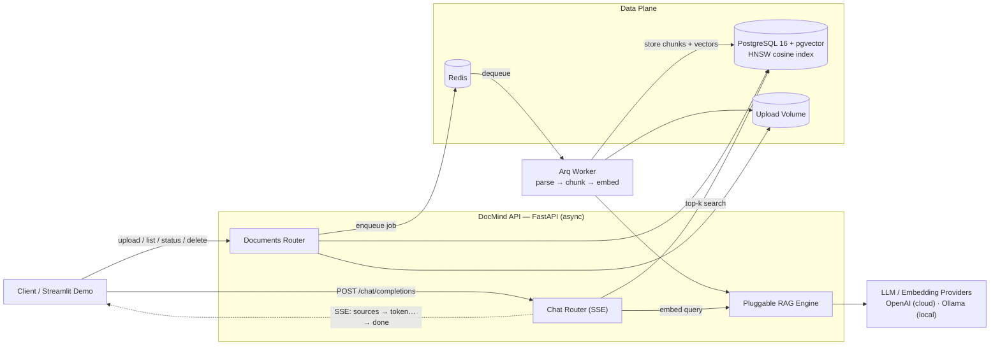
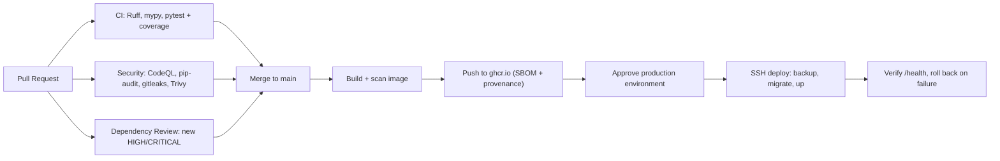

<!--
  DocMind API — landing README.
  Audience: Tech Leads & CTOs evaluating the project in under 10 seconds.
-->

# DocMind API

**Production-grade Retrieval-Augmented Generation (RAG) as a service — in one container.**

DocMind turns any document corpus (PDF, Markdown, CSV, JSON, plain text) into a
grounded, citation-backed chat API. It ships the parts that usually stall an AI
pilot: async ingestion, background embedding workers, pgvector similarity search,
token-streaming answers, typed configuration, and fail-fast credentials — all
orchestrated with Docker Compose.

> **Why teams pick it:** no vendor lock-in (swap OpenAI ↔ Ollama with one env
> var), no glue code (ingestion → indexing → retrieval → streaming is wired end
> to end), and no mystery state (typed schemas, migrations, and a `/health`
> probe for every dependency).


## Key Technical Highlights

- **True async, end to end.** FastAPI + `asyncpg` + SQLAlchemy 2.0 `AsyncSession`
  throughout — no sync I/O on the request path.
- **Decoupled ingestion.** Uploads return `202 Accepted` immediately; an `Arq`
  worker on Redis parses, chunks, embeds, and indexes in the background with
  bounded retries (`max_tries=3`, `job_timeout=600s`).
- **Pluggable RAG engine.** A single provider-agnostic facade swaps between
  **OpenAI** (cloud) and **Ollama** (self-hosted) for both embeddings and chat —
  selected purely by configuration.
- **Fast vector search.** `pgvector` cosine distance over an **HNSW index**
  (`m=16`, `ef_construction=64`), scoped optionally to a subset of documents.
- **Token-level streaming.** Answers are streamed as Server-Sent Events —
  `sources` first (so the UI can render citations instantly), then incremental
  `token` frames.
- **Fail-fast configuration.** Pydantic v2 settings with cross-field validators:
  missing DB credentials, provider keys, or invalid chunking invariants abort at
  startup instead of degrading silently.
- **Defense in depth.** No in-code secret defaults, non-root container user,
  upload allow-listing + size caps, opaque error payloads, `X-Request-ID`
  correlation, and structured JSON logging.
- **Operational readiness.** `/health` reports liveness plus live PostgreSQL and
  Redis probes, the image ships a `HEALTHCHECK`, and Alembic migrations (with the
  `vector` extension and HNSW index) run automatically before the API boots.

## Architecture



**Flow in one sentence:** the client uploads a file → the API persists it and
enqueues a job → the worker parses, chunks, embeds, and writes vectors → the
client asks a question → the API embeds the query, retrieves the top-k chunks
from pgvector, and streams a grounded answer with citations.

## Tech Stack

| Concern | Technology |
| --- | --- |
| Language | Python 3.12+ |
| Web framework | FastAPI (async) |
| Validation / settings | Pydantic v2 + `pydantic-settings` |
| Database | PostgreSQL 16 with `pgvector` |
| ORM / driver | SQLAlchemy 2.0 (async) + `asyncpg` |
| Migrations | Alembic (async env) |
| Task queue | Arq on Redis |
| Embeddings | OpenAI `text-embedding-3-small` **or** Ollama `nomic-embed-text` |
| Chat models | OpenAI `gpt-4o-mini` **or** Ollama `llama3.1:8b` |
| HTTP client | `httpx` (Ollama) + official `openai` SDK |
| Resillience | `tenacity` (exponential-backoff retries) |
| PDF extraction | `pypdf` |
| Logging | stdlib `logging` with JSON/console formatters |
| Demo UI | Streamlit |
| Packaging / infra | Hatchling, Docker (multi-stage), Docker Compose |
| Quality gates | Ruff, mypy, pytest (`pytest-asyncio`) |

## 1-Minute Quick Start

```bash
# 1. Configure (set a DB password; add OPENAI_API_KEY for cloud models)
cp .env.example .env

# 2. Launch the whole stack: API, worker, Postgres+pgvector, Redis, Ollama, demo
docker compose up --build
```

Migrations run automatically before the API starts. The API **fails fast** if
`POSTGRES_PASSWORD` (or `DATABASE_URL`) or `OPENAI_API_KEY` is missing.

| Surface | URL |
| --- | --- |
| Swagger UI | http://localhost:8000/docs |
| Health probe | http://localhost:8000/health |
| Streamlit demo | http://localhost:8501 |

**Ask your first question:**

```bash
# Upload a document (returns 202 Accepted with a processing document)
curl -F "file=@./handbook.pdf" http://localhost:8000/api/v1/documents/upload

# Stream a grounded answer (SSE)
curl -N -X POST http://localhost:8000/api/v1/chat/completions \
  -H "Content-Type: application/json" \
  -d '{"query": "What is our refund policy?", "top_k": 4}'
```

## API Endpoints

| Method | Path | Success | Response format |
| --- | --- | --- | --- |
| `POST` | `/api/v1/documents/upload` | `202` | JSON `DocumentResponse` (`processing`) — `400` empty, `413` too large, `415` unsupported type, `503` queue down |
| `GET` | `/api/v1/documents` | `200` | JSON `DocumentResponse[]` (newest first, with chunk counts) |
| `GET` | `/api/v1/documents/{id}/status` | `200` | JSON `DocumentResponse` — `404` not found |
| `DELETE` | `/api/v1/documents/{id}` | `204` | Empty body — `404` not found |
| `POST` | `/api/v1/chat/completions` | `200` | `text/event-stream` (SSE frames below) |
| `GET` | `/health` | `200` / `503` | JSON `{status, database, redis}` |
| `GET` | `/` | `200` | JSON `{name, version, docs}` |

**Document status lifecycle:** `processing` → `completed` | `failed`
(the `error` field carries the failure reason).

### SSE Event Contract

`POST /api/v1/chat/completions` emits ordered `text/event-stream` frames:

| Frame `type` | Payload | Meaning |
| --- | --- | --- |
| `sources` | `content[]`: `{document_id, filename, chunk_index, score, excerpt}` | Retrieved citations, sent first |
| `token` | `content`: `string` | One increment of the answer |
| `done` | — | Stream completed successfully |
| `error` | `message`, `request_id` | Failure, correlated to server logs (no internal details leaked) |

```text
data: {"type":"sources","content":[{"document_id":"…","filename":"handbook.pdf","chunk_index":0,"score":0.81,"excerpt":"…"}]}

data: {"type":"token","content":"Our "}

data: {"type":"token","content":"refund "}

data: {"type":"done"}
```

## Configuration Matrix

All settings are validated in [`src/config.py`](src/config.py:40) and can be
supplied via environment variables or a `.env` file.

| Variable | Default | Required | Notes |
| --- | --- | --- | --- |
| `POSTGRES_USER` | `postgres` | No | Database role |
| `POSTGRES_PASSWORD` | *(none)* | **Yes\*** | No insecure fallback; app fails fast |
| `POSTGRES_DB` | `docmind` | No | Database name |
| `POSTGRES_HOST` / `POSTGRES_PORT` | `localhost` / `5432` | No | Compose overrides host to `db` |
| `DATABASE_URL` | derived | No | Explicit async DSN; overrides `POSTGRES_*` (\*either this or the password is required) |
| `REDIS_HOST` / `REDIS_PORT` | `localhost` / `6379` | No | Compose overrides host to `redis` |
| `REDIS_DB` | `0` | No | Redis logical database |
| `REDIS_URL` | derived | No | Explicit DSN; overrides `REDIS_*` |
| `EMBEDDING_PROVIDER` | `openai` | No | `openai` or `ollama` |
| `LLM_PROVIDER` | `openai` | No | `openai` or `ollama` |
| `EMBEDDING_MODEL` | per provider | No | Defaults: `text-embedding-3-small` / `nomic-embed-text` |
| `LLM_MODEL` | per provider | No | Defaults: `gpt-4o-mini` / `llama3.1:8b` |
| `EMBEDDING_DIM` | `1536` / `768` | No | Must match model **and** migration |
| `RETRIEVAL_TOP_K` | `4` | No | Default chunks retrieved (override per request: 1–20) |
| `CHUNK_SIZE` | `500` | No | Whitespace-token window |
| `CHUNK_OVERLAP` | `50` | No | Must be `< CHUNK_SIZE` |
| `OPENAI_API_KEY` | *(none)* | **Yes\*\*** | Required when any provider is `openai` |
| `OLLAMA_BASE_URL` | `http://localhost:11434` | No | Required when a provider is `ollama` |
| `UPLOAD_DIR` | `data/uploads` | No | Shared volume in Compose |
| `MAX_UPLOAD_MB` | `25` | No | Enforced before persistence |
| `APP_NAME` | `DocMind API` | No | Shown in OpenAPI metadata |
| `PORT` | `8000` | No | Reference port for the service |
| `DEBUG` | `False` | No | Enables SQL echo; keep `False` in production |
| `LOG_LEVEL` | `INFO` | No | Recognised stdlib level names |
| `LOG_JSON` | `True` | No | Single-line JSON logs for containers |
| `CORS_ORIGINS` | `*` | No | Comma-separated origins, or `*` |

> **\*\*Fail-fast credentials:** if a provider is `openai` and `OPENAI_API_KEY`
> is unset, the application refuses to start.
>
> **Embedding dimension:** switching to a model with a different vector width
> requires updating `EMBEDDING_DIM` **and** regenerating the Alembic migration,
> then re-indexing. A mismatch surfaces as a pgvector dimension error.

## Development & Quality Assurance

**Local setup (without full Compose):**

```bash
python -m venv .venv && source .venv/bin/activate
pip install -e ".[dev,demo]"        # 'demo' adds Streamlit + requests for the UI
docker compose up -d db redis       # dependencies only
alembic upgrade head                # apply migrations
uvicorn src.main:app --reload       # API
arq src.worker.tasks.WorkerSettings # worker (separate shell)
```

**Quality gates:**

```bash
pytest          # async test suite (pytest-asyncio, asyncio_mode=auto)
ruff check .    # lint (E, F, I, UP, B)
mypy src        # static typing (pydantic plugin enabled)
```

| Gate | Tool | Scope |
| --- | --- | --- |
| Unit / API tests | pytest | API handlers, SSE encoding, chunker, parser, vector store |
| Lint | Ruff | Line length 100, target `py312` |
| Types | mypy | `src/`, with the pydantic mypy plugin |

The test suite covers the SSE frame contract, source serialization, text
chunking invariants, file parsing, and vector-store query construction.

## CI/CD & Deployment

Delivery is fully automated: pull requests are gated, `main` produces a signed
image, and an approved deploy rolls out to the VPS with automatic rollback.



| Workflow | Trigger | Purpose |
| --- | --- | --- |
| [`ci.yml`](.github/workflows/ci.yml) | PR / push to `main` | Ruff, mypy, pytest with a 70% coverage gate |
| [`security.yml`](.github/workflows/security.yml) | PR / push / weekly | CodeQL, pip-audit, gitleaks, Trivy FS |
| [`dependency-review.yml`](.github/workflows/dependency-review.yml) | PR to `main` | Fails when a new dependency has a HIGH/CRITICAL advisory |
| [`release-image.yml`](.github/workflows/release-image.yml) | push to `main` / tags | Build, Trivy-scan, push to GHCR with SBOM + provenance |
| [`deploy.yml`](.github/workflows/deploy.yml) | after release / manual | Gated SSH rollout to the VPS with health verify + rollback |

**Production topology:** [`docker-compose.prod.yml`](docker-compose.prod.yml)
runs a standalone stack with no published database/Redis ports, log rotation,
and resource limits; only the API is bound to `127.0.0.1:8000` for a reverse
proxy. The rollout logic lives in
[`.github/deploy/remote-deploy.sh`](.github/deploy/remote-deploy.sh).

### Required GitHub configuration

| Kind | Name | Purpose |
| --- | --- | --- |
| Environment | `production` | Required reviewers (manual approval gate) |
| Secret | `SSH_HOST`, `SSH_USER`, `SSH_KEY`, `SSH_PORT`, `DEPLOY_PATH` | VPS access + repo location |
| Secret | `GHCR_USER`, `GHCR_PULL_TOKEN` | Pull the private image on the VPS |
| Variable | `PRODUCTION_URL` | Environment link shown in the Actions UI |

The VPS keeps its own `.env` (application secrets such as `POSTGRES_PASSWORD`
and `OPENAI_API_KEY`); those values are never stored in this repository.

### Local commands

```bash
make install   # editable install + pre-commit hooks
make check     # lint + format + types + coverage (same gates as CI)
make up        # docker compose up --build -d
make cov       # pytest with coverage report
```

## Repository Structure

```text
docmind/
├── .github/
│   ├── dependabot.yml               # Weekly pip / actions / docker updates
│   ├── deploy/remote-deploy.sh      # VPS rollout + rollback logic
│   └── workflows/                   # ci · security · dependency-review · release-image · deploy
├── alembic/
│   ├── env.py                       # Async Alembic environment
│   └── versions/0001_initial.py     # vector extension + HNSW index
├── alembic.ini
├── docker-compose.yml               # db · redis · api · worker · ollama · demo
├── docker-compose.prod.yml          # Hardened production stack
├── Dockerfile                       # Multi-stage, non-root runtime
├── Makefile                         # Local task runner (mirrors CI)
├── .pre-commit-config.yaml          # Ruff, mypy, gitleaks, whitespace hooks
├── pyproject.toml                   # Deps, Ruff, mypy, pytest, coverage config
├── .env.example                     # Documented configuration template
├── demo/
│   └── app_ui.py                    # Streamlit demo client
├── src/
│   ├── main.py                      # App factory, lifespan, /health, request-id
│   ├── config.py                    # Pydantic v2 settings + validators
│   ├── logging_config.py            # JSON / console structured logging
│   ├── api/v1/
│   │   ├── router.py                # Aggregates v1 routers
│   │   ├── documents.py             # Upload, list, status, delete
│   │   └── chat.py                  # SSE-streamed grounded answers
│   ├── db/
│   │   ├── base.py                  # Async engine, session factory, deps
│   │   └── models.py                # Document, DocumentChunk (pgvector)
│   ├── schemas/                     # Pydantic request/response + SSE types
│   ├── services/
│   │   ├── rag_engine.py            # Provider-agnostic LLM + embeddings
│   │   ├── vector_store.py          # Cosine similarity search
│   │   ├── chunker.py               # Token-aware overlapping chunks
│   │   └── parser.py                # Suffix validation + text/PDF extraction
│   └── worker/
│       ├── tasks.py                 # Arq task + WorkerSettings
│       └── queue.py                 # Shared Redis pool
└── tests/
    ├── conftest.py
    ├── test_api.py
    ├── test_chat_sse.py
    ├── test_chunker.py
    ├── test_parser.py
    └── test_vector_store.py
```

## Troubleshooting

| Symptom | Likely cause | Fix |
| --- | --- | --- |
| `/health` returns `degraded` | Postgres or Redis unreachable | `docker compose ps`, then check logs |
| Uploads stuck in `processing` | Worker not running / can't reach Redis | Ensure the `worker` service is up |
| `415 Unsupported Media Type` | Extension not allow-listed | Allowed: `txt`, `md`, `csv`, `json`, `pdf` |
| pgvector dimension error | `EMBEDDING_DIM` ≠ model output | Align the value, re-run migrations, re-index |
| API exits immediately | Missing DB password or provider key | Set `POSTGRES_PASSWORD` / `OPENAI_API_KEY` in `.env` |

## Security

Please report vulnerabilities privately through GitHub's **Private
Vulnerability Reporting** (Security tab → **Report a vulnerability**) — never in
a public issue. See [`SECURITY.md`](SECURITY.md) for supported versions, scope,
our response timeline, and safe-harbor terms. Automated checks (CodeQL,
pip-audit, Dependency Review, gitleaks, Trivy) run in
[`security.yml`](.github/workflows/security.yml).

## License

Released under the **MIT License**. See the `LICENSE` file for the full text
(if your distribution does not include it, add one at the repository root before
publishing).
