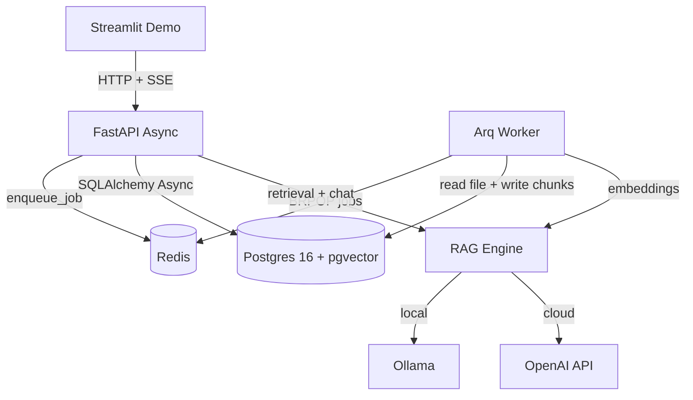

# DocMind API — Remediation Plan to 100% Working State

## Goal
Turn the current skeleton into a runnable, production-grade RAG microservice: `docker compose up --build` starts Postgres+pgvector, Redis, API, Arq worker, and Streamlit demo; uploads are parsed, chunked, embedded, and searchable; chat streams real SSE tokens.

## Target Architecture

## Workstreams

### 1. Packaging & Tooling
- Add `[build-system]` (hatchling) to `pyproject.toml`; declare packages under `src/`.
- Move dev deps to a supported section; remove bogus `[tool.poetry]`.
- Add missing runtime deps: `pypdf` (PDF parsing), `orjson` optional, `tenacity` (retries).
- Add `[tool.ruff]`, `[tool.mypy]`, `[tool.pytest.ini_options]`.
- Create `.dockerignore`.

### 2. Docker / Compose
- Fix `Dockerfile`: remove invalid process substitution, install from `pyproject.toml`, add non-root user, layer caching.
- Compose: add `POSTGRES_HOST=db` / `DATABASE_URL`, add `alembic upgrade head` on API start, add optional `ollama` profile, healthchecks for redis, service-name URLs for demo.

### 3. Config Layer
- Extend `Settings`: derived `database_url`, `redis_url`, `EMBEDDING_DIM`, `EMBEDDING_MODEL`, `LLM_MODEL`, provider literals.
- Keep `extra="ignore"`, add `.env` support and validation.

### 4. Database Layer
- Fix imports in `db/base.py`; add engine/session lifecycle + `get_db_session`.
- Models: configurable `Vector(settings.EMBEDDING_DIM)`, status via `Enum`, `metadata` JSONB column (attribute-mapped), created/updated timestamps, relationship tuning.
- Add **Alembic**: `alembic.ini`, `alembic/env.py` (async), initial migration enabling `CREATE EXTENSION vector` + HNSW cosine index.

### 5. Services
- `rag_engine.py`: fix imports, provider abstraction, configurable models/dimensions, real async streaming (`async for`), retries/timeouts.
- `vector_store.py`: fix imports, require real session, optional document filter, return similarity score.
- `chunker.py`: token-aware chunking with overlap, preserve word boundaries.

### 6. Worker (Arq)
- Fix import paths; task signature `(ctx, document_id)`.
- Real file read from storage (txt/pdf), chunk, embed, insert, set `completed`/`failed`, `await session.commit()`.
- `WorkerSettings` with `functions` list + `redis_settings` from config; startup/shutdown hooks.

### 7. API Layer
- Fix all import paths; import `Depends`.
- `documents.py`: persist uploads, real arq enqueue via shared pool, compute real `chunk_count`, add list + delete endpoints.
- `chat.py`: obtain session as dependency, reference retrieval with real session, true SSE token streaming, error events.
- `router.py`/`main.py`: mount at `/api/v1`, lifespan to init/close engine + redis pool, `/health` checks DB+Redis, global exception handlers.

### 8. Demo UI
- Use env-driven `API_BASE_URL` (docker service name), fix `st.markdown` kwarg, robust SSE parsing, better status polling.

### 9. Tests & Docs
- pytest + httpx `ASGITransport` tests: chunker, vector search (mocked), API upload/chat, health.
- Update README endpoints/structure, add run instructions and provider switching.

### 10. Verification
- `docker compose build` succeeds; `up` healthy; migrations applied; upload a .txt/.pdf; status becomes `completed`; chat streams tokens with correct sources.

## Out of Scope (confirm if desired)
- AuthN/AuthZ, multi-tenant isolation, S3 storage backend, CI pipeline, observability stack.
